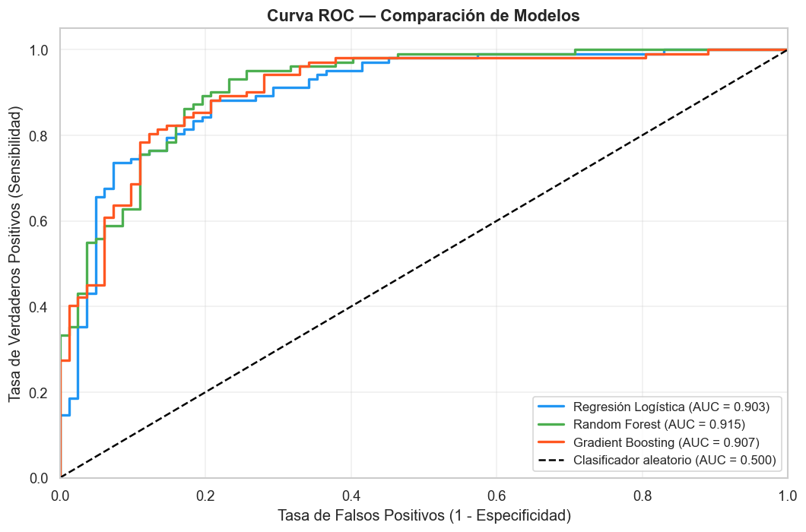

# Heart_Disease_MACHINE_LEARNING
# 🫀 Predicción de Enfermedades Cardíacas con Machine Learning

  

Proyecto de Machine Learning aplicado al diagnóstico temprano de enfermedades cardiovasculares, desarrollado siguiendo la metodología **CRISP-DM** (Cross Industry Standard Process for Data Mining).

## 📋 Descripción

Las enfermedades cardiovasculares son la principal causa de muerte a nivel mundial (~17,9 millones de muertes anuales según la OMS). Este proyecto explora el dataset **Heart Disease UCI** (920 pacientes, 16 variables clínicas) para construir un modelo capaz de predecir la presencia de enfermedad cardíaca a partir de indicadores como presión arterial, colesterol, frecuencia cardíaca máxima y otros parámetros médicos.

El trabajo recorre las cinco etapas de CRISP-DM:

1. **Comprensión del negocio** — definición del problema clínico y del objetivo de predicción.
2. **Comprensión de los datos** — análisis exploratorio, distribuciones, valores nulos, outliers y correlaciones.
3. **Preparación de los datos** — binarización de la variable objetivo, limpieza, imputación (mediana/moda), codificación (Label Encoding / One-Hot) y escalado de variables.
4. **Modelado** — entrenamiento y comparación de tres algoritmos de clasificación: **Regresión Logística**, **Random Forest** y **Gradient Boosting**, evaluados con matriz de confusión, F1-Score, validación cruzada (5-Fold) y curvas ROC/AUC.
5. **Conclusiones** — selección del modelo final en base a un análisis comparativo integral de las métricas obtenidas.

## 🛠️ Tecnologías

- Python (Pandas, NumPy, Scikit-learn)
- Matplotlib / Seaborn para visualización
- Jupyter Notebook

## 📊 Dataset

[Heart Disease UCI](https://archive.ics.uci.edu/dataset/45/heart+disease) — 920 registros de pacientes, 16 variables clínicas.

## 👤 Autor

Pablo Maximiliano Báez Godoy
